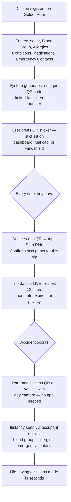
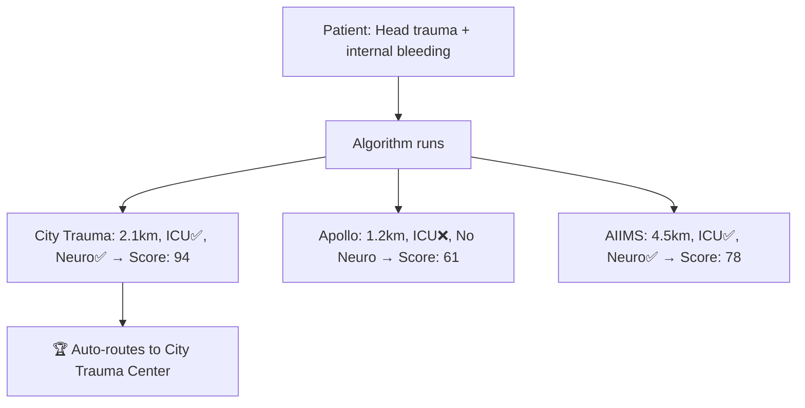
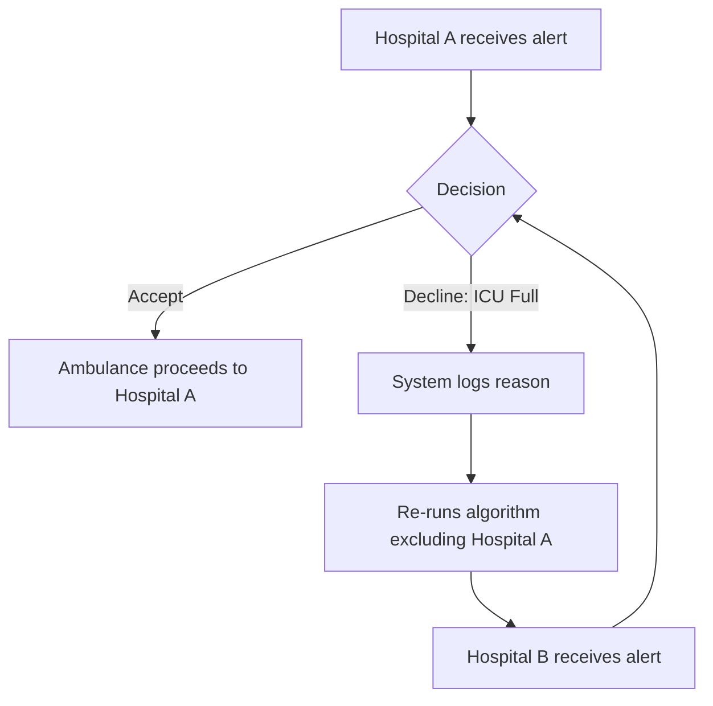

# wox
surakstasetu — Complete Project Blueprint

> **Tagline:** *"The ambulance arrives. The victim is unconscious. The QR on the dashboard tells us everything we need to save their life."*

---

## 🎯 The Problem

Every year in India, thousands of accident victims die not because treatment was unavailable — but because:

- ❌ Ambulances don't know which hospital has capacity
- ❌ Hospitals aren't prepared when the patient arrives
- ❌ Victims are unconscious with no identity
- ❌ Families have no idea where their loved one was taken
- ❌ Critical minutes are wasted on phone calls, paperwork, and wrong turns

**surakhasetuu** solves every one of these problems in a single, coordinated platform.

---

## 🏗️ What Is surakhasetuu?

surakhasetuu is a **real-time emergency coordination platform** that connects:

| Role | Who | What they do |
|------|-----|-------------|
| 🚑 **EMS / Ambulance** | Paramedic on the ground | Collects vitals, identity, sends data ahead to hospital |
| 🏥 **Hospital** | Emergency ward admin/nurse | Receives patient data in advance, prepares resources, accepts/declines |
| 👮 **Police** | Traffic/emergency officer | Verifies identity, handles unknown patients, files incident report |
| 👨‍💻 **Citizen** | Every vehicle owner | Pre-registers their health profile via Vehicle QR |
| 👨‍👩‍👧 **Family** | Emergency contact | Real-time tracking link, auto-SMS notifications |

---

## 🌟 The Core Innovation: Vehicle QR Health Passport

This is the feature that makes GoldenHour unique and solves the identity problem at its root.

### How It Works — Step by Step



### What the QR Page Shows to the Paramedic

When a paramedic scans the QR at an accident scene, a public page opens instantly:

```
┌─────────────────────────────────────────┐
│  🚨 GoldenHour Emergency Profile         │
│  Vehicle: MH02AB1234  [ACTIVE TRIP]      │
├──────────────────┬──────────────────────┤
│ DRIVER           │ PASSENGER 1          │
│ Ravi Kumar       │ Priya Sharma         │
│ Blood: O+        │ Blood: A-            │
│ Allergy: Aspirin │ Condition: Diabetic  │
│ Contact: 98XXXX  │ Contact: 97XXXX      │
├──────────────────┴──────────────────────┤
│ ⚠️ CRITICAL NOTES                        │
│ Ravi is on blood thinners (Warfarin)    │
│ Priya carries insulin — check left bag  │
└─────────────────────────────────────────┘
```

**No login. No app. Just scan → see everything.**

---

## 🔄 The Complete Emergency Workflow

### Phase 1: Before the Accident (Citizen Side)

1. Citizen opens GoldenHour website/app
2. Registers once: blood group, allergies, conditions, medications
3. Enters vehicle number → system generates unique Vehicle QR
4. Prints sticker → sticks on dashboard
5. Before every ride: scans QR → taps "Start Trip" → adds passengers if any
6. After safe arrival: taps "End Trip" → data clears from public view

---

### Phase 2: The Accident

1. Accident occurs
2. **Bystander Coordination** (optional feature): GoldenHour silently alerts trained first-aiders within 500m
   > *"Accident 400m from you. Patient unconscious. Ambulance ETA: 12 mins. Can you help?"*
3. Someone calls 108 / triggers SOS
4. Ambulance is dispatched

---

### Phase 3: At the Scene (Ambulance / EMS)

```mermaid
graph LR
    A[Ambulance arrives] --> B[Paramedic scans\nVehicle QR]
    B --> C[Gets all occupant data instantly]
    C --> D[Uses Voice-to-Text to record\nclinical observations hands-free]
    D --> E[Gemini AI converts voice note into\nstructured medical summary]
    E --> F[Enters vitals: Pulse, BP, SpO2, Temp]
    F --> G[AI Predictive Score generated:\n'73% risk of cardiac event in 12 mins']
    G --> H[Dynamic Routing Algorithm selects\nbest hospital in real-time]
    H --> I[Clinical data + AI summary sent\nto hospital BEFORE arrival]
```



**Ambulance Dashboard key actions:**
- 📷 Scan vehicle QR for instant identity
- 🎙️ Voice-to-text clinical notes
- 📊 Enter vitals (live telemetry)
- 🤖 Gemini AI clinical summary
- 🏥 Send data ahead to hospital
- 👮 Send identity data to police
- ⏱️ Set ETA

---

### Phase 4: Hospital Selection (Dynamic Routing)

The system doesn't just pick the nearest hospital — it picks the **best** one using a real-time score:

| Factor | Weight |
|--------|--------|
| Distance (lower = better) | 35% |
| ICU availability | 25% |
| Specialist match for injury type | 20% |
| Trauma bay readiness | 15% |
| Blood bank availability | 5% |



> The nearest hospital lost because it had no neurosurgeon. **GoldenHour picks smart, not just close.**

---

### Phase 5: Hospital Acceptance / Rejection

Hospital Dashboard receives the inbound alert:

- ✅ **Accepts:** Ambulance confirmed on route. Hospital begins preparation.
- ❌ **Declines (e.g., "ICU Full"):**
  - Reason is logged
  - Algorithm re-runs, excluding this hospital
  - Ambulance is auto-rerouted to next best hospital
  - This loops until a hospital accepts



---

### Phase 6: Hospital Preparation (While Ambulance is En Route)

Hospital Dashboard shows the paramedic's data in advance:
- Patient name, blood group, allergies
- Vitals + trend chart
- AI clinical summary
- Injuries and symptoms
- Treatment already given in the field
- Gemini-powered **Pre-Op Medicine Requisition:**
  > *"Auto-prepare: 2 units O- blood, trauma surgery kit, IV morphine — based on: leg fracture + internal bleeding"*

Hospital staff toggle their **Clinical Readiness Matrix:**
- ICU Ready ✅
- Blood Arranged ✅
- Specialist Called ✅
- Trauma Bay Active ✅
- Medicines Prepared ✅

---

### Phase 7: Family Notification

The moment the case is created, the system automatically:

1. **SMS/WhatsApp to emergency contact:**
   > *"🚨 Ravi Kumar has been in an accident. Ambulance AMB-01 is taking him to City Trauma Center. ETA: 12 minutes."*

2. **Live tracking link sent:**
   > *"Track: goldenhour.app/track/CASE-4821"*
   
   This link shows (no login needed):
   - 🚑 Live ambulance position on map
   - ⏱️ Real-time ETA countdown
   - 💓 Patient status (Stable / Critical / In Surgery)
   - 🏥 Hospital destination + address

3. **Arrival SMS:**
   > *"Ravi has arrived at City Trauma Center. Please come to the Emergency Ward, Ground Floor."*

---

### Phase 8: Arrival & Handover (QR Handover)

When the ambulance reaches the hospital door:

- Paramedic shows a **QR code on their screen**
- Hospital nurse scans it with their phone
- **All case data transfers instantly** — vitals, history, AI summary, photos, treatments given
- No verbal handoff → No information loss
- A **digital receipt** is generated with timestamp + personnel signatures (immutable audit trail)

---

### Phase 9: Police Side

Police Dashboard handles:
- **Identity Verification:** Cross-checks data received from ambulance
- **Unknown Patient:** If identity couldn't be found via Vehicle QR:
  - Upload patient photo → Facial match attempt
  - If no match → Gemini AI extracts physical clues (tattoos, clothing, build)
  - Broadcasts a BOLO (Be On Look Out) alert to nearby stations
- **FIR Filing:** Accident details, location, vehicle involved
- **Authorization Badge:** Gives official police verification stamp on the case

---

## 🗺️ City-Wide Command View (Government / Admin)

A read-only heatmap dashboard for health officials:

| View | What It Shows |
|------|--------------|
| 🟢🟡🔴 Hospital Heatmap | Every hospital, colour-coded by capacity in real-time |
| 📈 Accident Hotspots | Zones with highest accident frequency by hour |
| ⏱️ Response Time Audit | Average ambulance-to-hospital time by zone |
| 🚨 Surge Alerts | "3 critical patients inbound to Zone 4 in next 15 mins" |
| 📊 Weekly Reports | Outcomes, bottlenecks, resource gaps |

---

## 🛠️ Technology Stack

| Layer | Technology |
|-------|-----------|
| Frontend | React + TypeScript + Vite |
| Styling | Tailwind CSS |
| Database | Supabase (PostgreSQL + Realtime) |
| AI | Google Gemini API |
| Maps | Leaflet.js + OpenStreetMap |
| SMS/WhatsApp | Twilio API |
| QR Generation | `qrcode.js` library |
| Voice-to-Text | Web Speech API (built into browser) |
| Vehicle Lookup | VAHAN API (India) |
| Auth | Supabase Auth |

---

## 📦 Feature Completion Status

| Feature | Status |
|---------|--------|
| Role-based dashboards (EMS, Hospital, Police) | ✅ Built |
| Vitals entry | ✅ Built |
| Clinical data → Hospital | ✅ Built |
| Identity → Police | ✅ Built |
| Gemini AI summary | ✅ Built |
| Live map (simulated) | ✅ Built |
| Hospital readiness matrix | ✅ Built |
| Multi-case triage queue | ✅ Built |
| **Vehicle QR Health Passport** | 🔲 To Build |
| **Pre-ride check-in** | 🔲 To Build |
| **Dynamic hospital routing** | 🔲 To Build |
| **Hospital Accept / Decline + Fallback** | 🔲 To Build |
| **Family live tracking link** | 🔲 To Build |
| **Twilio SMS notifications** | 🔲 To Build |
| **Voice-to-text clinical notes** | 🔲 To Build |
| **AI Predictive Vitals Score** | 🔲 To Build |
| **QR handover at hospital** | 🔲 To Build |
| **City-wide heatmap** | 🔲 To Build |
| **Supabase Realtime sync** | 🔲 To Build |

---

## 🎤 Hackathon Pitch (60 seconds)

> *"Every year, thousands of people die in road accidents — not because hospitals were too far, but because the system was too slow.*
> 
> *With GoldenHour:*
> *The QR on your dashboard already knows your blood group, your allergy to aspirin, and that your wife is your emergency contact.*
> *Before the ambulance even arrives, AI has selected the best hospital, not just the nearest one.*
> *By the time you reach the ER, the ward is prepared, the surgeon is ready, and your family is already on their way — because they got a live tracking link the moment you were found.*
> *We don't just coordinate emergencies. We compress time — because in an accident, time is the only resource that can't be replaced."*

---

## 🏆 Why This Wins

| Judge Criterion | What GoldenHour Delivers |
|----------------|--------------------------|
| **Innovation** | Vehicle QR Health Passport — no existing product does this |
| **Technical Depth** | AI routing, Gemini integration, real-time sync, voice-to-text |
| **Real-world Impact** | Directly addresses India's #1 cause of preventable death |
| **User Empathy** | Solves for paramedic (hands full), family (helpless), unconscious victim |
| **Scalability** | City-wide heatmap makes it a government-level infrastructure tool |
| **Demo-ability** | Live stage demo: speak vitals → AI processes → hospital prepares → family gets SMS |
